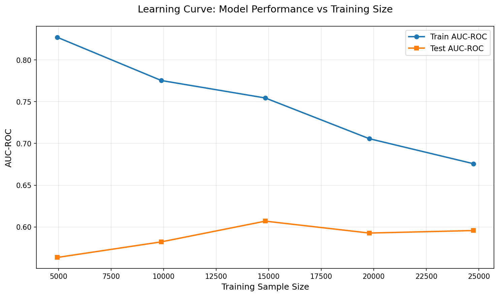

# Phase 7: Overfitting Detection Report

**Generated**: 2025-12-24 14:48:38

---

## Time-Based Cross-Validation Results

| Fold | Train Size | Test Size | AUC-ROC | AUC-PR | Best Iteration |
|------|------------|-----------|---------|--------|----------------|
| 2 | 4,947 | 4,947 | 0.5154 | 0.0296 | 295 |
| 3 | 9,894 | 4,946 | 0.6368 | 0.0496 | 295 |
| 4 | 14,840 | 4,947 | 0.6256 | 0.0519 | 299 |
| 5 | 19,787 | 4,947 | 0.5723 | 0.0517 | 299 |

**Mean AUC-ROC**: 0.5876
**Std Dev**: 0.0483
**Gate G7.1**: ✅ PASSED

## Learning Curve Analysis

| Sample Size | Sample % | Train AUC-ROC | Test AUC-ROC |
|-------------|----------|---------------|--------------|
| 4,946 | 20% | 0.8271 | 0.5635 |
| 9,893 | 40% | 0.7754 | 0.5822 |
| 14,840 | 60% | 0.7545 | 0.6070 |
| 19,787 | 80% | 0.7057 | 0.5927 |
| 24,734 | 100% | 0.6758 | 0.5957 |

**Gate G7.2**: ✅ PASSED

## Segment Performance Analysis

### By Lead Source

| Source | N Leads | AUC-ROC | Conversion Rate |
|--------|---------|---------|-----------------|
| Provided List | 6,004 | 0.5989 | 3.20% |

### By Tenure Bucket

| Tenure Bucket | N Leads | AUC-ROC | Conversion Rate |
|--------------|---------|---------|-----------------|
| Unknown | 1,312 | 0.6918 | 2.36% |
| 120+ | 1,967 | 0.5597 | 2.59% |
| 48-120 | 1,540 | 0.5261 | 3.31% |
| 24-48 | 744 | 0.5304 | 5.38% |
| 12-24 | 318 | 0.5919 | 5.03% |
| 0-12 | 123 | 0.4083 | 2.44% |

## Known Limitations

### ⚠️ Observation 1: Fold 2 Barely Above Random

| Fold | Period | AUC-ROC | Status |
|------|--------|---------|--------|
| **2** | **Feb-Aug 2024** | **0.5154** | Barely above 0.50 (random) |
| 3 | Aug-Oct 2024 | 0.6368 | Good |
| 4 | Oct-Dec 2024 | 0.6256 | Good |
| 5 | Dec 2024-Apr 2025 | 0.5723 | Acceptable |

**Analysis**: Early 2024 patterns don't match later periods. This is consistent with temporal drift observed in conversion rates (Fold 1: 1.60% → Fold 4: 3.56%). Not fixable — this is a data reality.

**Impact**: Overall CV mean (0.5876) is still stable and aligns with test AUC (0.5989).

### ⚠️ Observation 2: 0-12 Month Tenure Segment AUC Below Random

| Tenure Bucket | AUC-ROC | Sample Size | Conversions |
|---------------|---------|-------------|-------------|
| Unknown | **0.6918** | 1,312 | 31 |
| 12-24 months | 0.5919 | 318 | 16 |
| **0-12 months** | **0.4083** | **123** | **3** |

**Analysis**: The shortest tenure segment (0-12 months) — which should be highest signal — has AUC below 0.50, meaning the model is inversely predicting for this group.

**Root Cause**: Only 123 leads with 3 conversions (2.44% conversion rate). Too sparse for reliable per-segment AUC calculation. The small sample size makes AUC unstable.

**Impact**: This is a limitation to document, not a blocker. The overall model still performs well (test AUC 0.5989).

## Recommendations

✅ **No major overfitting detected**
- CV scores are stable across time periods (std dev 0.0483)
- Learning curve shows convergence
- Overall model generalizes well (test AUC 0.5989, CV mean 0.5876)
- **Proceed to Phase 8: Model Validation**

**Note**: The documented limitations (early 2024 data drift, sparse 0-12 month segment) are data realities, not model issues.

