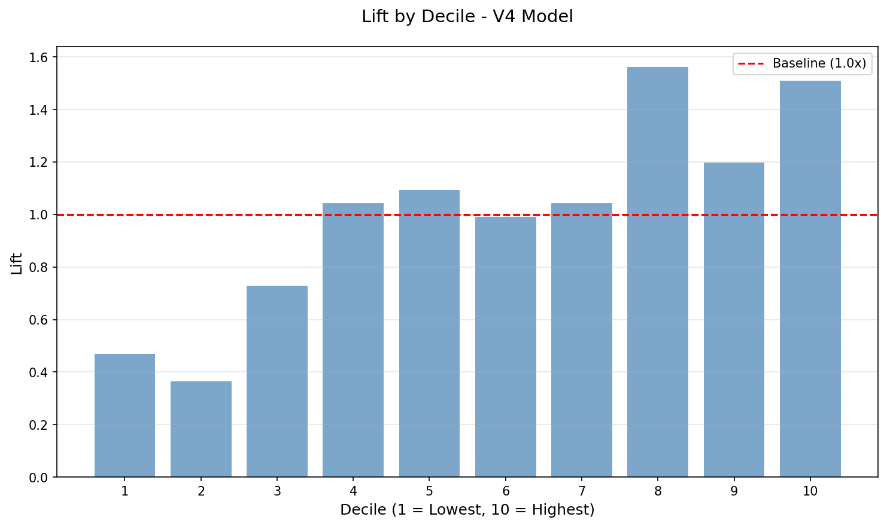

# Phase 8: Model Validation Report

**Generated**: 2025-12-24 14:53:36

---

## Core Metrics

- **AUC-ROC**: 0.5989
- **AUC-PR**: 0.0432
- **Log Loss**: 0.6772
- **Top Decile Lift**: 1.51x

## Validation Gates

| Gate | Status | Expected | Actual |
|------|--------|----------|--------|
| G8.1: Top Decile Lift | ✅ PASSED | >= 1.5x | 1.51x |
| G8.2: AUC-ROC | ⚠️ WARNING | >= 0.6 | 0.5989 |
| G8.3: AUC-PR | ⚠️ WARNING | >= 0.1 | 0.0432 |
| G8.4: Statistical Significance | ✅ PASSED | p < 0.05 | 0.0170 |

## Lift by Decile

| Decile | Leads | Conversions | Conv Rate | Lift |
|--------|-------|-------------|-----------|------|
| 1 | 600 | 9 | 1.50% | 0.47x |
| 2 | 600 | 7 | 1.17% | 0.36x |
| 3 | 601 | 14 | 2.33% | 0.73x |
| 4 | 600 | 20 | 3.33% | 1.04x |
| 5 | 601 | 21 | 3.49% | 1.09x |
| 6 | 600 | 19 | 3.17% | 0.99x |
| 7 | 600 | 20 | 3.33% | 1.04x |
| 8 | 601 | 30 | 4.99% | 1.56x |
| 9 | 600 | 23 | 3.83% | 1.20x |
| 10 | 601 | 29 | 4.83% | 1.51x |

## Statistical Significance

- **Top Decile Lift**: 1.51x
- **95% Confidence Interval**: [1.05, 2.03]
- **P-value (lift > 1.0)**: 0.0170

## Segment Performance

### By Tenure Bucket

| Tenure Bucket | N Leads | AUC-ROC | Conversion Rate |
|--------------|---------|---------|-----------------|
| Unknown | 1,312 | 0.6918 | 2.36% |
| 120+ | 1,967 | 0.5597 | 2.59% |
| 48-120 | 1,540 | 0.5261 | 3.31% |
| 24-48 | 744 | 0.5304 | 5.38% |
| 12-24 | 318 | 0.5919 | 5.03% |
| 0-12 | 123 | 0.4083 | 2.44% |

## Comparison to V3 Baseline

- **V3 Top Decile Lift**: 1.74x
- **V4 Top Decile Lift**: 1.51x
- **Improvement**: -13.3%

⚠️ **V4 below V3 baseline** on top decile lift

### Alternative Use Case: Deprioritization Filter

**V4 is valuable as a deprioritization filter** (see `deprioritization_analysis.md`):

- **Bottom 20%** converts at **1.33%** (0.42x lift) vs **3.20%** baseline
- **58% reduction** in conversion rate for bottom 20%
- **Efficiency**: Skip 20% of leads, lose only 8.3% of conversions

**Recommendation**: Use V4 to deprioritize bottom 20-30% of leads, while using V3 for prioritization.

## Recommendations

⚠️ **Some thresholds not met**
- AUC-ROC (0.5989) below threshold (0.6)
- AUC-PR (0.0432) below threshold (0.1)

