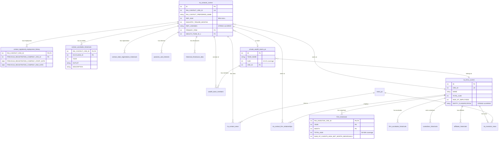

# FINTRX Dataset Architecture Overview

## Executive Summary

The FINTRX dataset in `savvy-gtm-analytics.FinTrx_data` contains comprehensive information about Registered Investment Advisors (RIAs) and financial advisors in the United States. The dataset consists of **25 tables** with approximately **30+ million total records**, tracking both current state and historical snapshots of advisors, firms, and related entities.

### Key Statistics
- **Total Tables**: 25
- **Total Records**: ~30+ million
- **Primary Contacts Table**: `ria_contacts_current` (788,154 rows, 2.87 GB)
- **Primary Firms Table**: `ria_firms_current` (45,233 rows, 129 MB)
- **Historical Snapshots**: `Firm_historicals` (926,712 rows covering 23 monthly snapshots from 2024-2025)
- **Unique Firms Tracked**: 49,645 firms with historical data
- **Date Range**: Historical data spans from January 2024 to November 2025 (23 monthly snapshots)

---

## ⚠️ CRITICAL: Point-in-Time (PIT) Limitations

**IMPORTANT**: For lead scoring, you need to understand what historical data is actually available.

### What IS Available for PIT Queries

| Data Type | PIT Possible? | How | Table(s) |
|-----------|---------------|-----|----------|
| **Firm AUM** | ✅ **YES** | Use `Firm_historicals` with YEAR/MONTH filter | `Firm_historicals` |
| **Rep's Employer** | ✅ **YES** | Use `contact_registered_employment_history` date filter | `contact_registered_employment_history` |
| **Rep's Accolades** | ✅ **YES** | Use `contact_accolades_historicals` YEAR filter | `contact_accolades_historicals` |
| **Rep's State Registrations** | ✅ **YES** | Use `contact_state_registrations_historicals` period/date filter | `contact_state_registrations_historicals` |
| **Rep's BD State Registrations** | ✅ **YES** | Use `contact_broker_dealer_state_historicals` period/date filter | `contact_broker_dealer_state_historicals` |
| **Firm Custodians** | ✅ **YES** | Use `custodians_historicals` period filter | `custodians_historicals` |
| **Disclosures** | ✅ **YES** | Use `Historical_Disclosure_data` EVENT_DATE filter | `Historical_Disclosure_data` |

### What is NOT Available for PIT Queries

| Data Type | PIT Possible? | Why Not | Current Source |
|-----------|---------------|---------|----------------|
| **Rep's Licenses** | ❌ **NO** | Only current state stored | `ria_contacts_current.REP_LICENSES` |
| **Rep's AUM** | ❌ **NO** | Only current state (and 99% NULL anyway) | `ria_contacts_current.REP_AUM` |
| **Rep's Tenure** | ⚠️ **PARTIAL** | Can calculate from employment history, not stored field | Calculate from `contact_registered_employment_history` |
| **Team AUM** | ❌ **NO** | Only current state | `private_wealth_teams_ps.AUM` |
| **Rep's Contact Info** | ❌ **NO** | Only current state | `ria_contacts_current` |
| **Rep's Firm Relationship** | ⚠️ **PARTIAL** | Can infer from employment history, not direct snapshot | `contact_registered_employment_history` |

### ⚠️ NO Contact-Level Historical Snapshots

**CRITICAL FINDING**: There are **NO contact-level historical snapshot tables**. The `ria_contacts_current` table contains **current state only**. 

- ❌ No monthly snapshots of contact data
- ❌ No historical tracking of contact AUM, licenses, or other contact-level metrics
- ✅ Only firm-level snapshots exist (`Firm_historicals`)

**Implication**: For PIT lead scoring, you can only use:
1. Firm-level historical data (via `Firm_historicals`)
2. Employment history (via `contact_registered_employment_history`)
3. Accolades (via `contact_accolades_historicals` with YEAR filter)
4. State registrations (via historical registration tables)

You **cannot** get a rep's historical AUM, licenses, or other contact-level metrics as of a past date.

---

## Primary Entities

### 1. Contacts (Reps/Advisors)
- **Primary Table**: `ria_contacts_current`
- **Key Identifier**: `RIA_CONTACT_CRD_ID` (Central Registration Depository ID)
- **Alternative ID**: `ID` (FINTRX internal identifier)
- **Total Records**: 788,154 unique contacts
- **Historical Data**: ❌ **NO** - current state only

### 2. Firms (RIA Firms)
- **Primary Table**: `ria_firms_current`
- **Historical Table**: `Firm_historicals` (monthly snapshots)
- **Key Identifier**: `CRD_ID`
- **Alternative ID**: `ID` (FINTRX internal identifier)
- **Total Records**: 45,233 unique firms (current)
- **Historical Records**: 926,712 snapshots (23 months × ~40,000 firms/month)
- **Historical Data**: ✅ **YES** - monthly snapshots available

### 3. Teams
- **Primary Table**: `private_wealth_teams_ps`
- **Key Identifier**: `ID`
- **Total Records**: 26,368 teams
- **AUM Coverage**: ⚠️ Only 20.1% have AUM data (5,304 teams)
- **Historical Data**: ❌ **NO** - current state only

---

## Historical Snapshot System

### How Snapshots Work

The dataset uses a **monthly snapshot system** for tracking changes over time, but **ONLY for firm-level data**:

#### Firm Snapshots: `Firm_historicals`
- **Snapshot Fields**: `YEAR`, `MONTH`, `QUARTER`
- **Date Range**: January 2024 to November 2025 (23 snapshots)
- **Coverage**: ~40,000 firms per month
- **AUM Coverage**: 92-93% of firm snapshots have AUM data
- **Each firm can have multiple rows** (one per snapshot month)

#### Contact History (NOT Snapshots)
- **Employment History**: `contact_registered_employment_history` tracks where reps worked over time
  - Fields: `PREVIOUS_REGISTRATION_COMPANY_START_DATE`, `PREVIOUS_REGISTRATION_COMPANY_END_DATE`
  - 2.2 million employment records
  - Average 2.8 records per contact
  
- **State Registrations**: `contact_state_registrations_historicals` tracks rep state registrations over time
  - 19.1 million registration records
  - Uses `period` field (format: "YYYY-MM") and `registerations_registeration_date`

- **Accolades**: `contact_accolades_historicals` tracks awards over time
  - Uses `YEAR` field for temporal filtering
  - 37,900 accolade records (14,501 unique contacts = 1.8% coverage)

### Point-in-Time (PIT) Query Pattern

For lead scoring, you must use data that existed **BEFORE** the contact date to avoid data leakage:

```sql
-- Example: Get firm snapshot as of June 2024 (before July 1, 2024 contact)
WITH contact_event AS (
  SELECT 
    12345 AS firm_crd,
    DATE('2024-07-01') AS contact_date,
    2024 AS contact_year,
    7 AS contact_month
)
SELECT 
  h.*
FROM `savvy-gtm-analytics.FinTrx_data.Firm_historicals` h
CROSS JOIN contact_event ce
WHERE h.RIA_INVESTOR_CRD_ID = ce.firm_crd
  AND (
    h.YEAR < ce.contact_year 
    OR (h.YEAR = ce.contact_year AND h.MONTH < ce.contact_month)
  )
ORDER BY h.YEAR DESC, h.MONTH DESC
LIMIT 1;
```

**Note**: This pattern only works for firm-level data. For contacts, you can only use:
- Employment history (filter by date ranges)
- Accolades (filter by YEAR)
- State registrations (filter by period/date)

---

## Table Categories

### CORE_CONTACTS
- `ria_contacts_current` - Current state of all RIA contacts/reps
  - ⚠️ **NO historical snapshots** - current state only

### CORE_FIRMS
- `ria_firms_current` - Current state of all RIA firms
- `Firm_historicals` - ✅ Monthly firm-level snapshots (AUM, clients, etc.)

### HISTORICAL_SNAPSHOTS
- `Firm_historicals` - ✅ Monthly firm snapshots (ONLY table with monthly snapshots)
- `contact_registered_employment_history` - Employment history (date-based, not snapshots)
- `contact_state_registrations_historicals` - State registration history (period-based)
- `contact_broker_dealer_state_historicals` - BD state registration history
- `custodians_historicals` - Custodian relationships over time (period-based)
- `affiliates_historicals` - Firm affiliate relationships over time

### ENRICHMENT_DATA
- `passions_and_interests` - Personal interests/hobbies for rapport building ("Donut Test")
  - ⚠️ Current state only (no historical)
- `contact_accolades_historicals` - Contact awards/recognition (e.g., Forbes Top 250)
  - ✅ Historical with YEAR field
- `firm_accolades_historicals` - Firm-level awards
- `private_wealth_teams_ps` - Team-level data including TEAM_AUM
  - ⚠️ Current state only, only 20.1% have AUM

### NEWS_SIGNALS
- `news_ps` - News articles/mentions
- `ria_contact_news` - Links news to contacts
- `ria_investors_news` - Links news to firms

### COMPLIANCE_REGULATORY
- `Historical_Disclosure_data` - Regulatory disclosures/violations
  - ✅ Historical with EVENT_DATE
- `industry_exam_bd_historicals` - Broker-Dealer exam history
- `industry_exams_ia_historicals` - Investment Advisor exam history
- `schedule_d_section_A_historicals` - SEC Form ADV Schedule D Section A
- `schedule_d_section_B_historicals` - SEC Form ADV Schedule D Section B

### RELATIONSHIPS
- `ria_contact_firm_relationships` - Contact-to-firm relationships
- `wealth_team_members` - Team membership
- `private_fund_data` - Private fund information
- `ria_investors_private_fund_relationships` - Firm-to-private fund relationships
- `contact_branch_data` - Branch office information

---

## Key Join Paths for Lead Scoring

### Contact → Firm
```
ria_contacts_current.PRIMARY_FIRM = ria_firms_current.CRD_ID
OR
ria_contacts_current.PRIMARY_RIA = ria_firms_current.CRD_ID
OR
ria_contacts_current.PRIMARY_BD = ria_firms_current.CRD_ID
```
**Match Rate**: 100% (no orphaned contacts)

### Contact → Historical Firm Data (PIT)
```
ria_contacts_current.PRIMARY_FIRM = Firm_historicals.RIA_INVESTOR_CRD_ID
WHERE Firm_historicals.YEAR = <target_year> 
  AND Firm_historicals.MONTH = <target_month>
  AND (YEAR < contact_year OR (YEAR = contact_year AND MONTH < contact_month))
```

### Contact → Employment History (PIT)
```
ria_contacts_current.RIA_CONTACT_CRD_ID = contact_registered_employment_history.RIA_CONTACT_CRD_ID
WHERE contact_date BETWEEN PREVIOUS_REGISTRATION_COMPANY_START_DATE 
  AND COALESCE(PREVIOUS_REGISTRATION_COMPANY_END_DATE, CURRENT_DATE())
```

### Contact → Accolades (PIT)
```
ria_contacts_current.RIA_CONTACT_CRD_ID = contact_accolades_historicals.RIA_CONTACT_CRD_ID
WHERE contact_accolades_historicals.YEAR <= <contact_year>
```

### Contact → Team
```
ria_contacts_current.WEALTH_TEAM_ID_1 = private_wealth_teams_ps.ID
OR
ria_contacts_current.WEALTH_TEAM_ID_2 = private_wealth_teams_ps.ID
OR
ria_contacts_current.WEALTH_TEAM_ID_3 = private_wealth_teams_ps.ID
```
**Coverage**: Only 13% of contacts on teams, only 4.1% can get team AUM

---

## Entity Relationship Diagram



---

## Recommended Approach for PIT Lead Scoring Model

### 1. Feature Engineering Strategy

#### Available for PIT Queries:
- ✅ **Firm AUM**: Use `Firm_historicals.TOTAL_AUM` from most recent snapshot before contact date
- ✅ **Employment**: Use `contact_registered_employment_history` to calculate tenure at time of contact
- ✅ **Accolades**: Use `contact_accolades_historicals` filtered by year <= contact year
- ✅ **State Registrations**: Use `contact_state_registrations_historicals` filtered by period/date
- ✅ **Disclosures**: Use `Historical_Disclosure_data` filtered by EVENT_DATE < contact date

#### NOT Available for PIT (Current State Only):
- ❌ **Rep AUM**: `ria_contacts_current.REP_AUM` (99% NULL anyway)
- ❌ **Team AUM**: `private_wealth_teams_ps.AUM` (only 20.1% coverage, current state only)
- ❌ **Licenses**: `ria_contacts_current.REP_LICENSES` (current state only)
- ❌ **Contact Info**: Email, phone, etc. (current state only)

#### Fallback Strategy:
1. **AUM Features**: 
   - Priority: Firm Historical AUM > Firm Current AUM > Team AUM (if available)
   - If all NULL, use median AUM for firm type

2. **Tenure Features**:
   - Calculate from `contact_registered_employment_history` when `INDUSTRY_TENURE_MONTHS` is NULL
   - Use employment start/end dates to determine tenure at contact date

3. **Licenses**:
   - Use current state (no historical available)
   - Note: This creates a small data leakage risk, but unavoidable

### 2. Data Quality Considerations

- **NULL Handling**: 
  - REP_AUM: 99.1% NULL - essentially unusable
  - Team AUM: 79.9% NULL - only 20.1% of teams have AUM
  - Firm AUM: 92-93% coverage in historical snapshots (good)
  
- **Coverage Issues**:
  - Accolades: Only 1.8% of contacts have accolades
  - Team AUM: Only 4.1% of contacts can get team AUM
  - Employment History: Generally complete (2.8 records per contact on average)

- **Snapshot Coverage**: 
  - Not all firms have snapshots for every month
  - Use most recent available snapshot before contact date
  - Larger firms more likely to have complete coverage

### 3. Key Identifiers Reference
- **CRD Number**: Central Registration Depository ID (unique per rep and firm)
- **FINTRX ID**: Internal FINTRX identifier (`ID` field)
- **SEC File Number**: SEC registration number for firms (not consistently available)

---

## Important Fields for Recruiting

### High-Value Signals
1. **Firm AUM** (`Firm_historicals.TOTAL_AUM`) - ✅ Available historically
2. **Team AUM** (`private_wealth_teams_ps.AUM`) - ⚠️ Only 20.1% coverage, current state only
3. **Accolades** (`contact_accolades_historicals`) - ✅ Available historically
   - Top sources: Forbes (27,880), Barron's (7,290), AdvisorHub (2,654)
4. **Disclosures** (`Historical_Disclosure_data`) - ✅ Available historically (disqualifier)
5. **Custodian** (`custodians_historicals`) - ✅ Available historically (tech stack indicator)
6. **Firm AUM Growth** (`Firm_historicals` - calculate YOY growth from snapshots) - ✅ Available

### Contact-Level Features (Current State Only)
- `REP_AUM` - Rep-level AUM (99% NULL - essentially unusable)
- `INDUSTRY_TENURE_MONTHS` - Years of experience (can calculate from employment history)
- `REP_LICENSES` - Series licenses held (STRING, not ARRAY - use JSON_EXTRACT_ARRAY())
- `PRODUCING_ADVISOR` - Boolean flag
- `CONTACT_OWNERSHIP_PERCENTAGE` - Ownership stake in firm

### Firm-Level Features (Available Historically)
- `TOTAL_AUM` - Firm total assets under management (via `Firm_historicals`)
- `NUM_OF_EMPLOYEES` - Firm size
- `ENTITY_CLASSIFICATION` - Firm type (STRING containing JSON array)
- `CUSTODIAN_PRIMARY_BUSINESS_NAME` - Primary custodian used (via `custodians_historicals`)

---

## Data Quality Observations

### Strengths
- ✅ Comprehensive coverage: 788K contacts, 45K firms
- ✅ Good historical coverage: 23 monthly snapshots (2024-2025) for firms
- ✅ Rich enrichment data: passions, accolades, news mentions
- ✅ Complete employment history: 2.2M records, average 2.8 per contact
- ✅ No orphaned contacts: 100% match rate for contact-to-firm joins

### Concerns
- ⚠️ **REP_AUM**: 99.1% NULL - essentially unusable
- ⚠️ **Team AUM**: Only 20.1% of teams have AUM data
- ⚠️ **Contact AUM Coverage**: Only 4.1% of contacts can get team AUM
- ⚠️ **Accolade Coverage**: Only 1.8% of contacts have accolades
- ⚠️ **No Contact Snapshots**: Cannot get historical contact-level data
- ⚠️ **JSON String Fields**: Many "array" fields are actually STRING type

### Recommendations
1. Use firm-level AUM as primary feature (more complete than rep/team)
2. Calculate tenure from employment history rather than relying solely on `INDUSTRY_TENURE_MONTHS`
3. Handle NULLs gracefully - many features will be missing for some contacts
4. Use team AUM when available, falling back to firm AUM
5. For JSON string fields, use `JSON_EXTRACT_ARRAY()` or `LIKE` queries
6. Accept that licenses and some contact-level features will be current state only (small data leakage risk)

---

## Next Steps

1. **Feature Engineering**: Build PIT feature extraction pipeline using available historical data
2. **Data Validation**: Run comprehensive data quality checks (see `FINTRX_Data_Quality_Report.md`)
3. **Model Development**: Use curated features from `FINTRX_Lead_Scoring_Features.md`
4. **Query Templates**: Reference `FINTRX_PIT_Query_Templates.sql` for common patterns

---

## Summary: What Makes This Dataset Unique

| Aspect | Details |
|--------|---------|
| **Historical Data** | ✅ Firm-level monthly snapshots (2024-2025) |
| **Contact Snapshots** | ❌ **NO** - current state only |
| **Employment History** | ✅ Complete (2.2M records) |
| **AUM Coverage** | Firm: 92-93% | Team: 20.1% | Rep: 0.9% |
| **Data Types** | Many "arrays" are actually STRING containing JSON |
| **PIT Capabilities** | Firm data: ✅ | Employment: ✅ | Accolades: ✅ | Licenses: ❌ |

